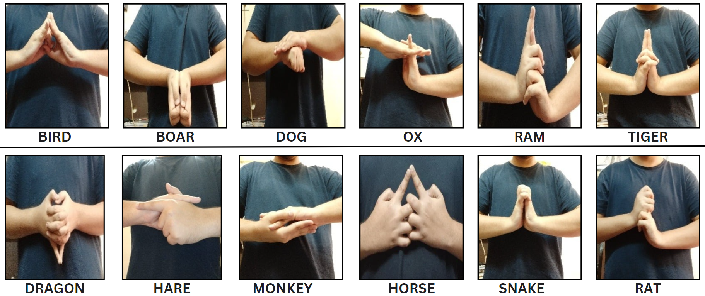

# NARUTO HAND SIGN DETECTION

I've developed a project called **Custom-Naruto-Hand-Seals-Detection**, where I implemented YOLO (You Only Look Once) and OpenCV to accurately detect hand signs from the popular anime Naruto. This project leverages state-of-the-art object detection techniques to recognize and classify different hand seals used in the series, providing a unique and fun application of computer vision.

# HANDSIGNS OVERVIEW

# DEMO

# STEPS FOLLOWED TO DEVELOPE THIS PROJECT

1. Capture images of each hand sign.
2. Annotate Images.
3. Setup YOLO.
4. Train custom object detection model.
5. Predict on Images and Videos.    
